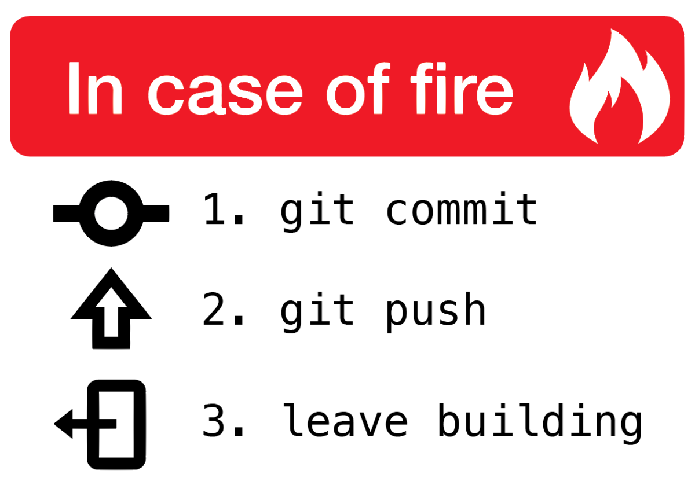
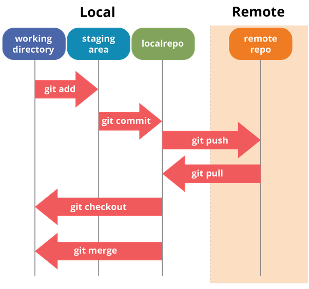
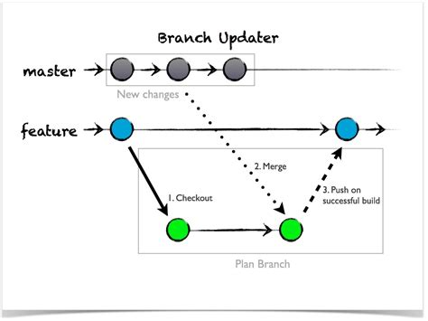

## Git

É un sistema de control de cambios en ficheiros (preferiblemente de texto).
Cada directorio git ten toda a información dos ficheiros, histórico dos cambios, etc,
sen necesidade dun nodo central.

https://githowto.com/

### Necesidade


Xestión dos cambios no código

- Compartir traballo con outros
- Seguir os cambios no ciclo de vida do programa
- Solicitar axuda e xestionalos aportes dos demáis



## Repositorios

- Github.com -> É o máis extendido, ten limitadas as contas privadas
- Bitbucket -> Pódese ter contas privadas

## Creación dun repositorio

É o lugar de almacenamento do noso proxecto


```
 echo "# Fluxo_de_traballo" >> README.md
 git init
 git add README.md
 git add * .
 git commit -m "first commit"
 git remote add origin https://github.com/jluisjuncal/Fluxo_de_traballo.git
 git push -u origin master
 
```

Diferencias Stagge/Commit

Os ficheiros modificados están en estado de **Staging** mentres non se lles faga un **Commit**,
pódese facer un **Commit** a algúns ficheiros e deixar os outros para posteriores **Commit**


## Master/Branch

Hai unha liña de desenrolo **Master** á que se lle poden crear ramas **Branch** para 
desenrolar melloras en paralelo.

```
git branch -av
 git checkout -b mellora
 git branch -av
 git checkout master
 git checkout mellora
 git branch -d mellora
 git branch -av
```




